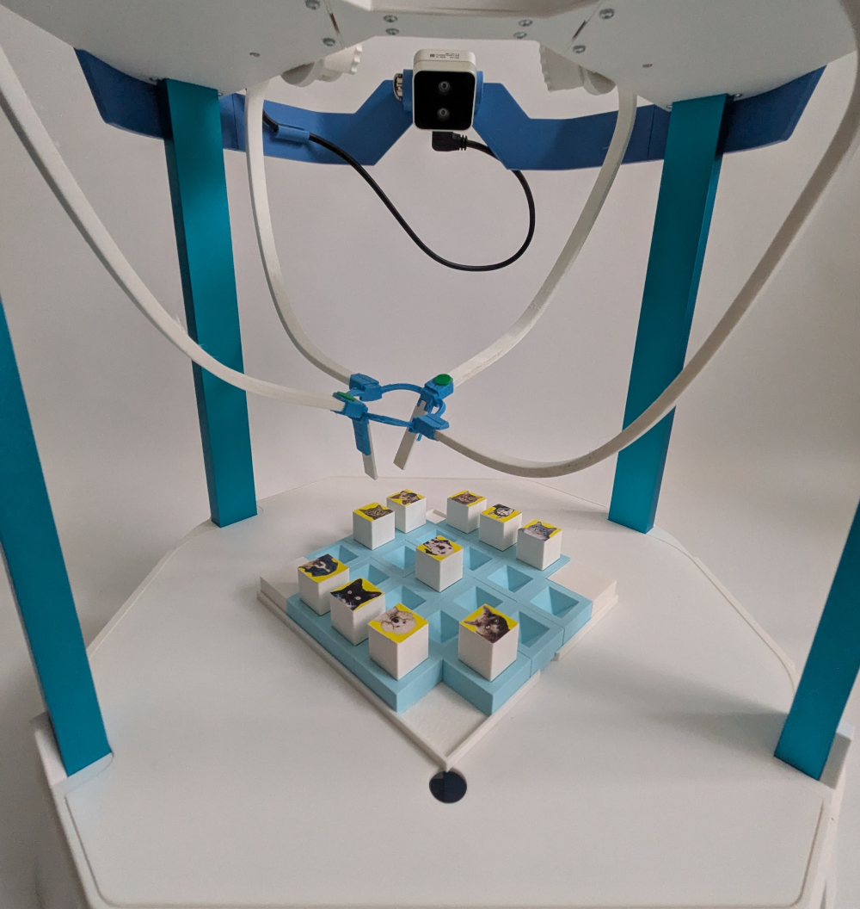

# Emio.demo_tictactoe


Play tic tac toe with Emio.

# Requirements

To launch the demo, you need to install: 

1. [**Emio Labs**](https://www.notion.so/1e3582ce7d3a80a688b0cba2515e3e77?pvs=21) (binaries)
2. Before going further, for computation time performance of the training and the inference of the model you can install [**CUDA**](https://developer.nvidia.com/cuda-downloads?target_os=Linux) and [**cuDNN**](https://developer.nvidia.com/cudnn-downloads) to make the AI run on the GPU (work only if there is a GPU). This is highly recommended (and [must be done first](https://github.com/hank-ai/darknet/blob/master/README_GPU_NVIDIA_CUDA.md)) but not required. 
3. [**Darknet**](https://github.com/hank-ai/darknet): Darknet is an open source neural network framework written in C, C++, and CUDA. No binaries are provided, you need to clone the GitHub project and compile from source. You can follow the instructions on the [GitHub repository](https://github.com/hank-ai/darknet).
4. [**DarkHelp**](https://github.com/stephanecharette/DarkHelp): The DarkHelp C++ API is a wrapper to make it easier to use the Darknet neural network framework within a C++ application. No binaries are provided, you need to clone the github project and compile from source. You can follow the instructions on the [GitHub repository](https://github.com/stephanecharette/DarkHelp).
5. Clone the Emio.demo_tictactoe GitHub project `git clone git@github.com:SofaComplianceRobotics/Emio.demo_tictactoe.git`, and add a symbolic link pointing to the `Emio.demo_tictactoe` folder into  `~/emio-labs/assets/labs/demo_tictactoe`
6. Download the vision model `yolov4` and put it in the folder `Emio.demo_tictactoe`: [download yolov4](https://www.dropbox.com/scl/fi/sdf96y6ox2y7zytx3u27v/Yolov4.zip?rlkey=klt43q78k88af744wc9kw62qw&st=uzruabdx&dl=1) 

# How To

To launch the demo, you can either use the provided .bat file (on Windows) or you can launch it with the following commands:

1. Environment path:
    
    ```bash
    # On Ubuntu
    export SOFA_ROOT=PATH_TO_SOFA_ROBOTICS_DIR
    export PATH=$PATH:$SOFA_ROOT/bin
    export PYTHONHOME=$SOFA_ROOT/bin/python
    export PYTHONPATH=$SOFA_ROOT/bin/python/lib/python3.10/site-packages
    export PYTHONPATH=$PYTHONPATH:$SOFA_ROOT/plugins/SofaPython3/lib/python3/site-packages
    export PYTHONPATH=$PYTHONPATH:PATH_TO_DarkHelp/src-python
    ```
    
    ```bash
    # On Windows
    # Using Powershell:
    $env.SOFA_ROOT=PATH_TO_SOFA_ROBOTICS_DIR
    $env.PATH+=$env.SOFA_ROOT\bin
    $env.PYTHONHOME=$env.SOFA_ROOT\bin\python
    $env.PYTHONPATH=$env.SOFA_ROOT\bin\python\Lib\site-packages
    $env.PYTHONPATH+=$env.SOFA_ROOT\plugins\SofaPython3\lib\python3\site-packages
    $env.PYTHONPATH+=PATH_TO_DarkHelp\src-python
    
    # On Windows
    # Using Command Prompt:
    set SOFA_ROOT=PATH_TO_SOFA_ROBOTICS_DIR
    set PATH=$PATH:$SOFA_ROOT\bin
    set PYTHONHOME=$SOFA_ROOT\bin\python
    set PYTHONPATH=$SOFA_ROOT\bin\python\Lib\site-packages
    set PYTHONPATH=$PYTHONPATH:$SOFA_ROOT\plugins\SofaPython3\lib\python3\site-packages
    set PYTHONPATH=$PYTHONPATH:PATH_TO_DarkHelp\src-python
    ```
    
    ```bash
    # On MacOS
    export SOFA_ROOT=PATH_TO_SOFA_ROBOTICS_DIR
    export PATH=$PATH:$SOFA_ROOT\bin
    export PYTHONPATH=$PYTHONPATH:PATH_TO_DarkHelp\src-python
    ```
2. In `DarkHelp.py` line 86 : `Predict.argtypes = [c_void_p, c_int, c_int, POINTER(c_uint8), c_int]` 
3. `cd ~/emio-labs/assets/labs/demo_tictactoe`
4. `python play.py` 
