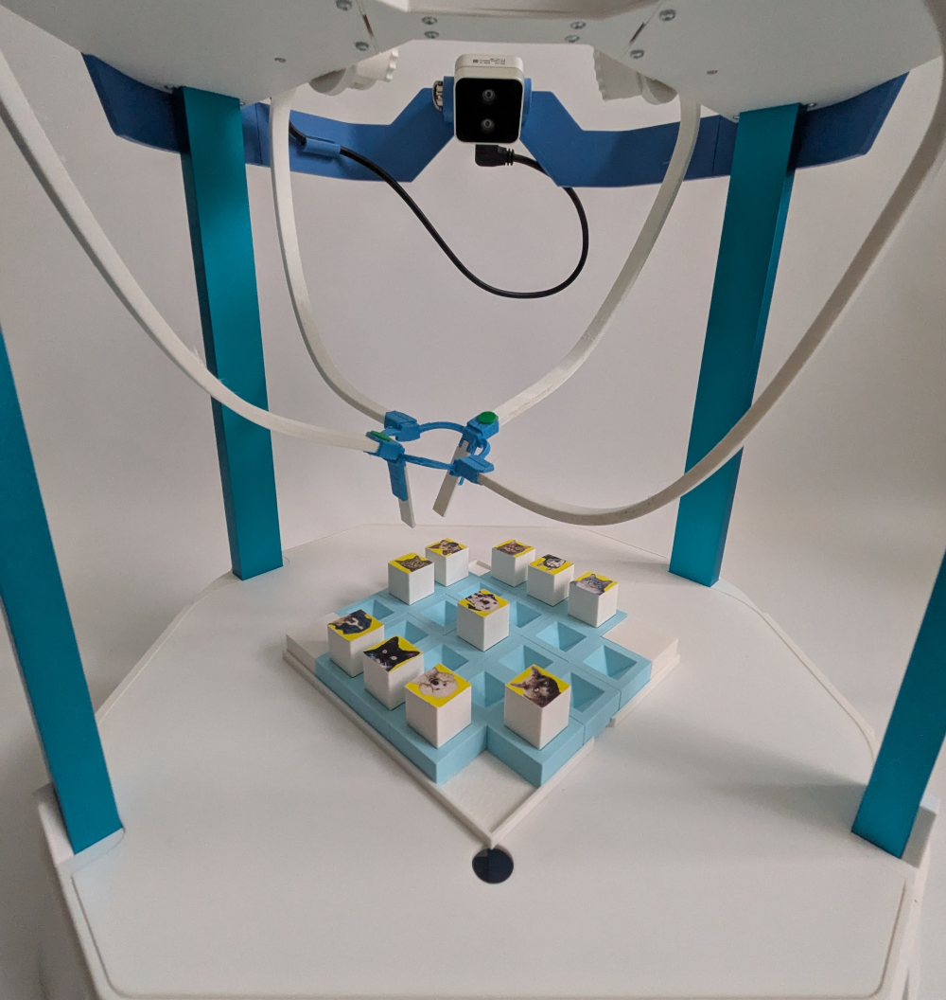
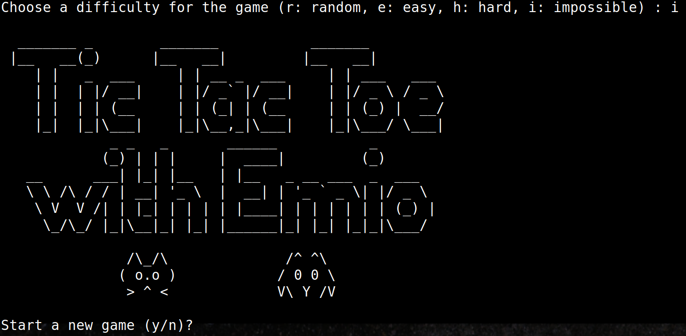
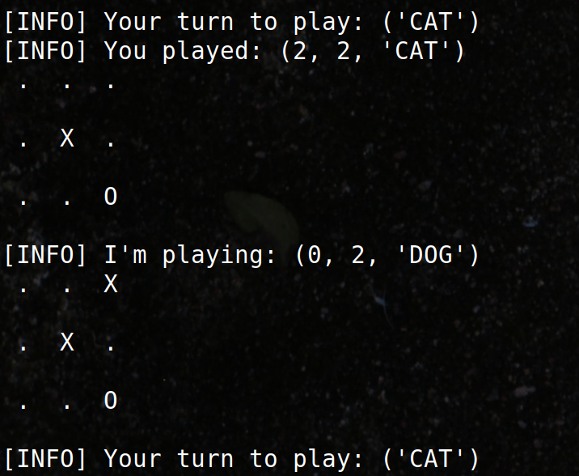

# Emio.demo_tictactoe



**Play tic tac toe with Emio**. The pawns are cubes with a photo of a cat or a dog on top. We trained Emio to recognize the cats and dogs. 
Choose a pawn and start playing with Emio.  

## Requirements

To launch the demo, you need to install: 

1. [**Emio Labs**](https://www.notion.so/1e3582ce7d3a80a688b0cba2515e3e77?pvs=21) (binaries)
2. Before going further, for computation time performance of the training you can install [**CUDA**](https://developer.nvidia.com/cuda-downloads?target_os=Linux) and [**cuDNN**](https://developer.nvidia.com/cudnn-downloads) to make the AI run on the GPU (work only if there is a GPU). This is highly recommended (and [must be done first](https://github.com/hank-ai/darknet/blob/master/README_GPU_NVIDIA_CUDA.md)) but not required. For the inference of the model you don't need GPU.
3. [**Darknet**](https://github.com/hank-ai/darknet): Darknet is an open source neural network framework written in C, C++, and CUDA. No binaries are provided, you need to clone the GitHub project and compile from source. You can follow the instructions on the [GitHub repository](https://github.com/hank-ai/darknet).
4. [**DarkHelp**](https://github.com/stephanecharette/DarkHelp): The DarkHelp C++ API is a wrapper to make it easier to use the Darknet neural network framework within a C++ application. No binaries are provided, you need to clone the github project and compile from source. You can follow the instructions on the [GitHub repository](https://github.com/stephanecharette/DarkHelp).
5. Clone the Emio.demo_tictactoe GitHub project `git clone git@github.com:SofaComplianceRobotics/Emio.demo_tictactoe.git`, and add a symbolic link pointing to the `Emio.demo_tictactoe` folder into  `~/emio-labs/assets/labs/demo_tictactoe`

## How To

To launch the demo:

1. Open a terminal
2. Set the environment path:
    
    ```bash
    # On Ubuntu
    export SOFA_ROOT=PATH_TO_SOFA_ROBOTICS_DIR
    export PATH=$PATH:$SOFA_ROOT/bin
    export PYTHONHOME=$SOFA_ROOT/bin/python
    export PYTHONPATH=$SOFA_ROOT/bin/python/lib/python3.10/site-packages
    export PYTHONPATH=$PYTHONPATH:$SOFA_ROOT/plugins/SofaPython3/lib/python3/site-packages
    export PYTHONPATH=$PYTHONPATH:PATH_TO_DarkHelp/src-python
    ```
    
    ```bash
    # On Windows
    # Using Powershell:
    $env.SOFA_ROOT=PATH_TO_SOFA_ROBOTICS_DIR
    $env.PATH+=$env.SOFA_ROOT\bin
    $env.PYTHONHOME=$env.SOFA_ROOT\bin\python
    $env.PYTHONPATH=$env.SOFA_ROOT\bin\python\Lib\site-packages
    $env.PYTHONPATH+=$env.SOFA_ROOT\plugins\SofaPython3\lib\python3\site-packages
    $env.PYTHONPATH+=PATH_TO_DarkHelp\src-python
    
    # On Windows
    # Using Command Prompt:
    set SOFA_ROOT=PATH_TO_SOFA_ROBOTICS_DIR
    set PATH=$PATH:$SOFA_ROOT\bin
    set PYTHONHOME=$SOFA_ROOT\bin\python
    set PYTHONPATH=$SOFA_ROOT\bin\python\Lib\site-packages
    set PYTHONPATH=$PYTHONPATH:$SOFA_ROOT\plugins\SofaPython3\lib\python3\site-packages
    set PYTHONPATH=$PYTHONPATH:PATH_TO_DarkHelp\src-python
    ```
    
    ```bash
    # On MacOS
    export SOFA_ROOT=PATH_TO_SOFA_ROBOTICS_DIR
    export PATH=$PATH:$SOFA_ROOT\bin
    export PYTHONPATH=$PYTHONPATH:PATH_TO_DarkHelp\src-python
    ```
3. In `DarkHelp.py` line 86 : `Predict.argtypes = [c_void_p, c_int, c_int, POINTER(c_uint8), c_int]` 
4. `cd ~/emio-labs/assets/labs/demo_tictactoe`
5. `python play.py`

### Troubleshooting:
- The `zmq` python module is needed. If you don't have it install you can use this command `python -m pip install zmq`
- In `PATH/TO/src/DarkHelp/src-python/Darkhelp.py`, replace line 17 with `libpath = "C:/Program Files/darkhelp/bin/darkhelp.dll"`

## Gameplay sequence

1. Follow the instructions on the terminal
2. Choose a difficulty between, "e" (easy), "r" (random), "h" (hard), and "i" (impossible)  
   
3. Emio will start by putting the pawns into the storage zone if the board is not clear.  
4. Once the board is clear, Emio will wait for you to start. If you don't do anything after 10 seconds it will choose a pawn and start the game.
5. At each round, after Emio plays, wait for the instruction to make your move.   
     
6. During the game, Emio will check the board at the end of each round and will try to correct it if there is any mismatch. It will try two times, then ask you to correct the board if it didn'd succeed. 
7. At the end of the game, Emio will ask you to play again.
